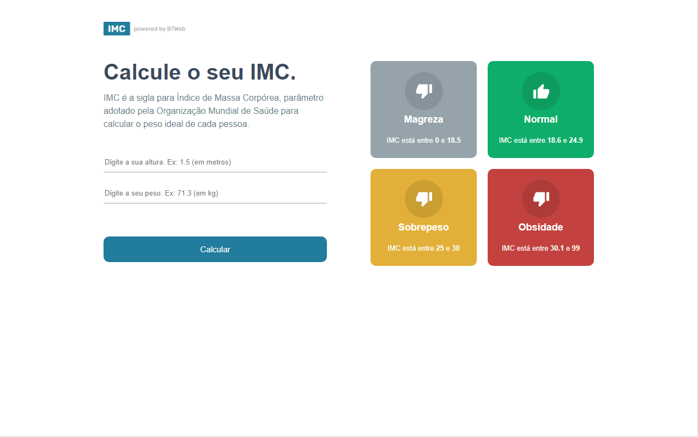
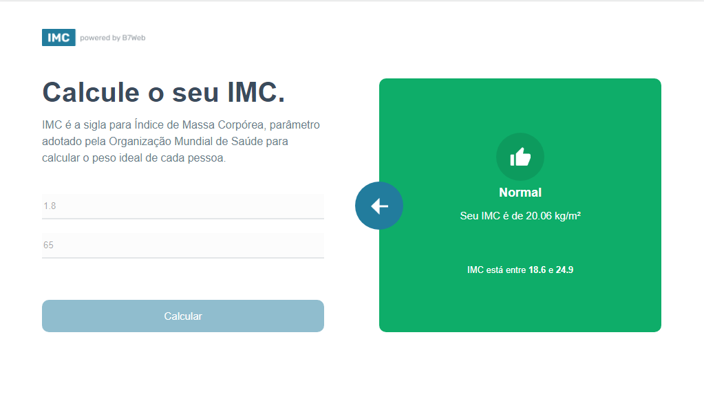
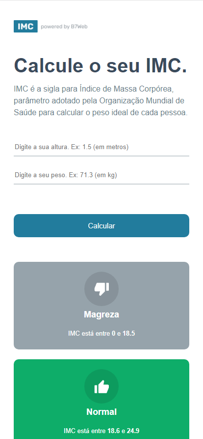
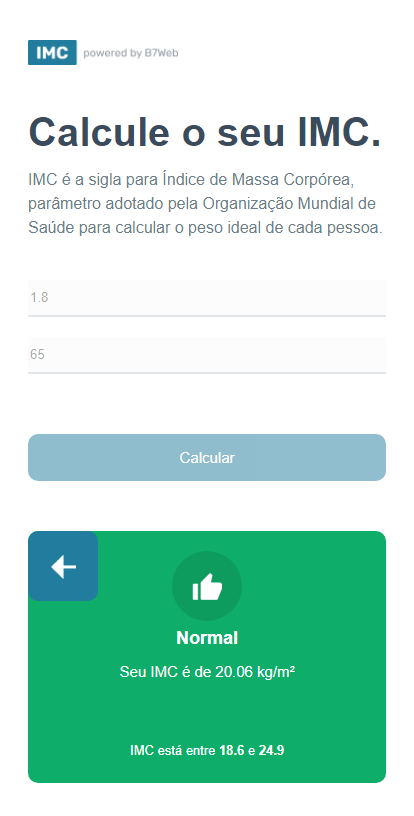

# Calculadora de IMC

Projeto em React + Typescript.

### Objetivo
Realizar o cálculo IMC e apresentar ao usuário se sua saúde está saudável.

### Imagens

### Instalação
- `npm install`

### Para rodar
- `npm start`
